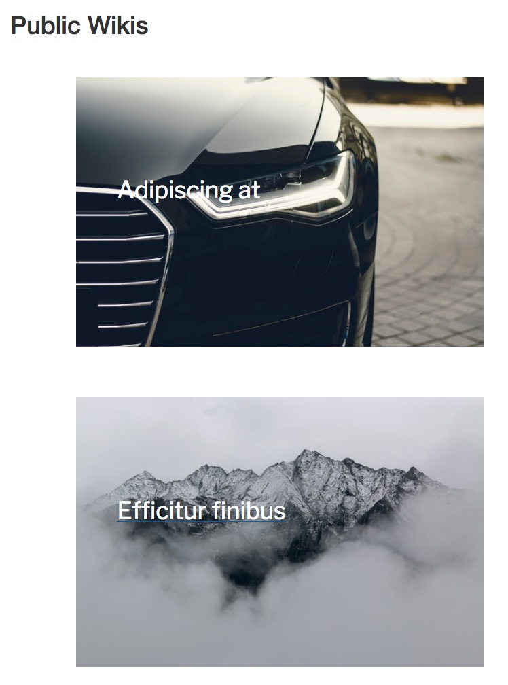

# Blocipedia

This community wiki platform was built using Ruby on Rails and Bootstrap. It utilizes a PostgreSQL database to store user information, wiki content, and permissions, privacy, and payment information, leveraging ORM capability to map and use the stored data. Blocipedia also integrates many useful gems, including Redcarpet, Stripe, Paperclip, Pundit, Devise, and more.

With Blocipedia, users can create their own public wikis, edit others, and even add pictures. However, if they want to up the ante, they can sign up for a (free) premium membership, which gives them the ability to create private wikis and invite collaborators to join them if they choose. Blocipedia is a work in progress, but shows my growing skill in building useful and usable applications from the backend to the frontend.

